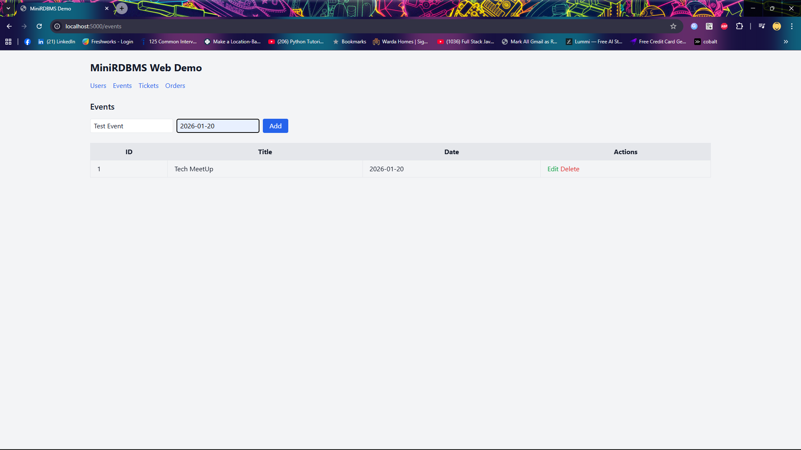
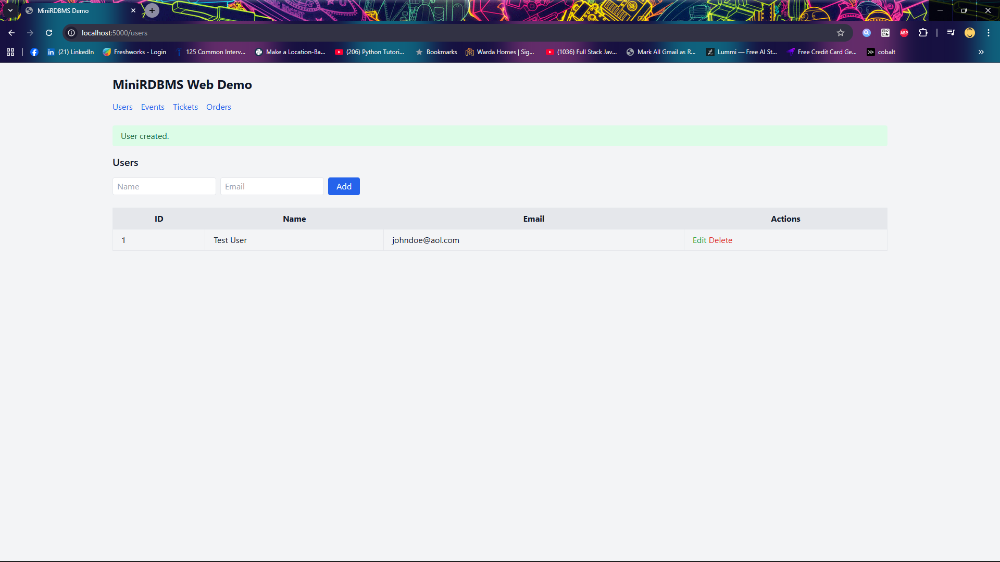
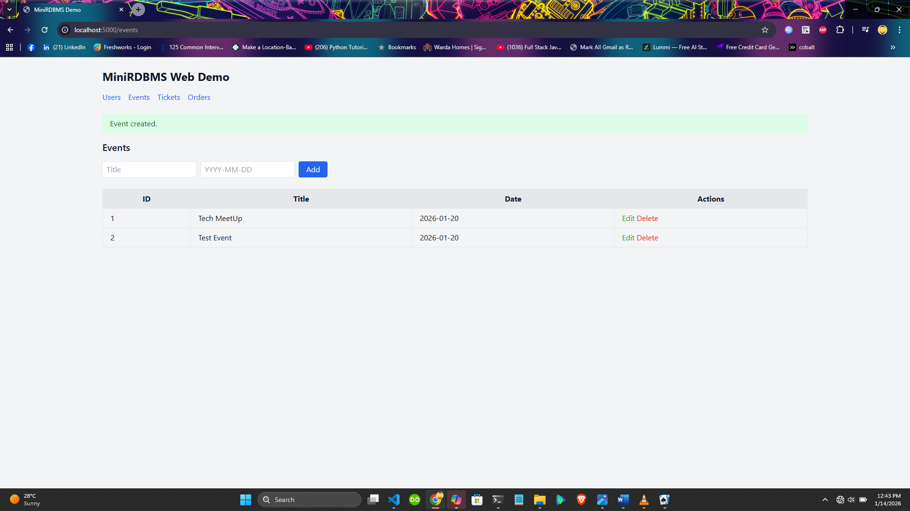
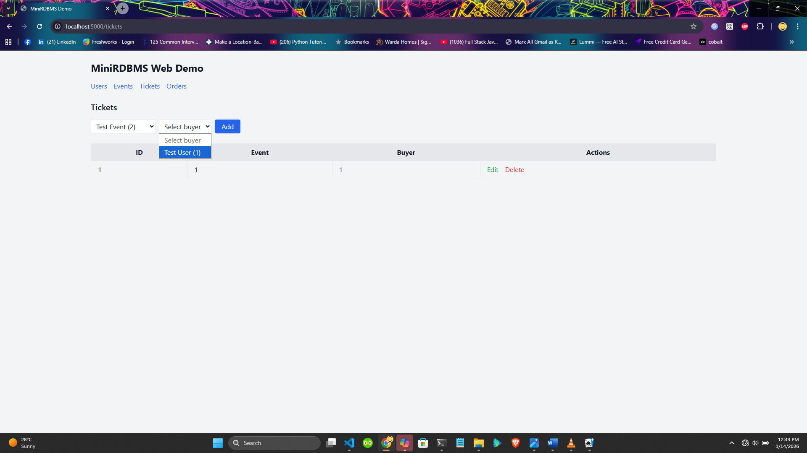
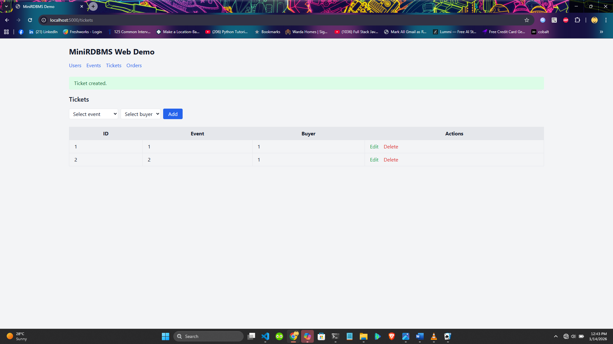
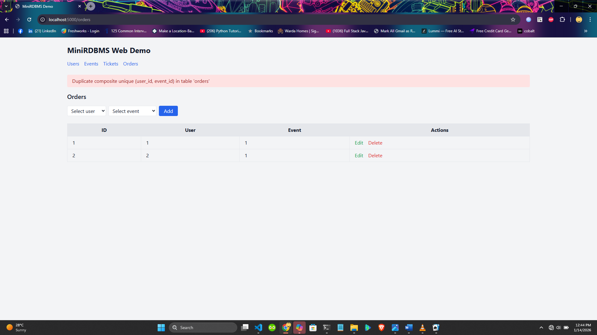

Here’s a solid starting point for your README.md. It’s structured to highlight the challenge requirements, what you’ve built, how to run it, and the tradeoffs you made. You can drop this into your repo and tweak details as needed:

# MiniRDBMS + Demo Web App

## Overview
This project is my attempt at the Pesapal JDEV26 challenge:  
**Design and implement a simple relational database management system (RDBMS)** with support for:
- Declaring tables with a few column data types
- CRUD operations
- Basic indexing
- Primary and unique keying
- Some joining
- SQL‑like interface and interactive REPL mode

To demonstrate the RDBMS, I built a trivial **Flask web app** that performs CRUD on `Users`, `Events`, `Tickets`, and `Orders`.

---

## Features

### RDBMS
- **SQL‑like parser**: supports `CREATE`, `INSERT`, `SELECT`, `UPDATE`, `DELETE`, and simple `JOIN`.
- **Data types**: `INTEGER`, `FLOAT`, `BOOLEAN`, `DATE`, `TEXT`.
- **Constraints**: primary key, unique, composite unique enforced on insert/update.
- **Indexing**: basic per‑column indexes for PK/UNIQUE; rebuilt/remapped after deletes.
- **Executor**: structured results (`{"ok": True/False, "result"/"error": ...}`).
- **Storage**: file‑backed rows, atomic writes for updates/deletes.
- **REPL**: interactive mode to run SQL commands directly.

### Web App
- CRUD pages for Users, Events, Tickets, Orders.
- Server‑assigned IDs (auto‑increment at route level).
- Dropdowns for foreign keys (user/event selection).
- Flash messages for errors and success.
- Joined display of user names and event titles in listings.
- Edit forms preselect current values.

---

## Quick Start

### Requirements
- Python 3.10+
- Flask

### Setup
```bash
git clone https://github.com/BwanaQ/hunja-RDBMS.git
cd hunja-RDBMS
pip install -r requirements.txt
```
### Run REPL
```bash
python -m rdbms.repl
```
### Example commands:

```bash

CREATE TABLE users (id INTEGER PRIMARY KEY, name TEXT UNIQUE, email TEXT);
INSERT INTO users (id, name, email) VALUES (1, 'Alice', 'alice@example.com');
SELECT * FROM users;
```

- A full list of demo commands check can be found here -> [examples/demo.sql](examples/demo.sql)
### Run Web App
```bash

flask --app webapp/app run
```
- Open http://localhost:5000  in your browser.

## Demo Walkthrough

### Create Users and Events via the UI.






### Add Tickets using dropdowns for buyer and event.



### Flash messages confirm success/errors.



## Implementation Choices and Tradeoffs

- Auto‑increment: For simplicity, IDs are assigned in the web routes rather than centralized in Storage.insert. This keeps the storage layer minimal for the demo. Centralization is a planned improvement.

- Foreign keys: No strict FK enforcement in the RDBMS layer; instead, the web app validates selections and surfaces errors.

- Indexes: Implemented only for PK/UNIQUE columns; not optimized for performance, but sufficient to demonstrate constraint enforcement and lookups.

## Attribution

- Built in Python with Flask for the demo UI.

- No external RDBMS libraries used; all parser/executor/storage code is original for this project.

- AI assistance was used to accelerate development and refine documentation. All code and design decisions were reviewed and integrated manually.

## Roadmap

- Centralize auto‑increment in Storage.insert.

- Add file locking for concurrent writes.

- Expand join support (outer joins, multi‑table queries).

- Add unit tests for parser edge cases and index remapping.

## License

[MIT License](https://opensource.org/license/mit)